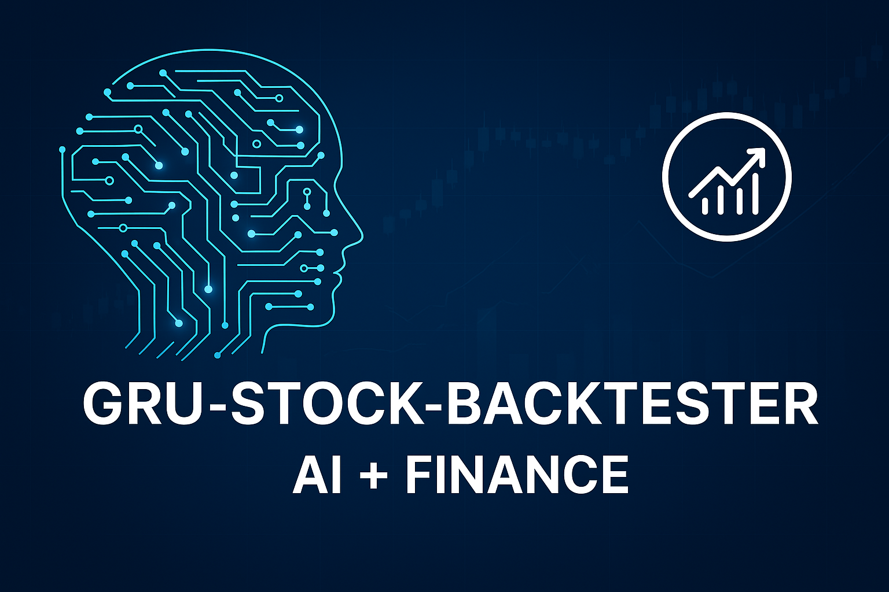

  

<h1 align="center">🤖 GRU Stock Backtester</h1>

AI-Powered Time Series Forecasting Meets Financial Strategy

  
  
  

## 🚀 Project Overview

`gru-stock-backtester` is a deep learning-driven stock market backtesting engine that fuses GRU-based time series forecasting with customizable trading strategies. Designed for financial experimentation and future-facing AI applications, it empowers developers, analysts, and researchers to evaluate market behavior with confidence.

This project combines deep learning with technical analysis and sentiment simulation to create an intelligent stock trading backtester. Using a multivariate GRU model and rule-based trade logic, it forecasts price movement and evaluates trade decisions over a 15-year historical window.

## 🧰 Key Features

- 📈 GRU-powered predictive modeling for stock price movements
- 🧪 Historical data simulation with flexible strategy injection
- 📊 Visual performance tracking of trades vs. predictions
- 📂 Modular architecture for easy strategy swap-ins

## 🔧 Getting Started

1. Clone the repository  
   `git clone https://github.com/your-username/gru-stock-backtester.git`
2. Install dependencies  
   `pip install -r requirements.txt`
3. Run the demo notebook  
   `jupyter notebook notebooks/gru_backtest_demo.ipynb`

🚀 Features
Multivariate GRU neural network trained on:

RSI, MACD, Volume Shift

Close price sequences

Simulated sentiment scoring from:

News, earnings, and social media

Hybrid trading logic using:

MACD crossovers

Sentiment thresholds

Model predictions

Performance metrics:

CAGR (Compound Annual Growth Rate)

Sharpe Ratio

Final Portfolio Value

📈 Tested Assets
Apple (AAPL)

Amazon (AMZN)

Tesla (TSLA)

Microsoft (MSFT)

🧪 Evaluation Snapshot
{
  'AAPL': {'CAGR': '-0.17%', 'Final Value': 9745.86, 'Sharpe': -0.15},
  'AMZN': {'CAGR': '-0.27%', 'Final Value': 9606.56, 'Sharpe': -0.25},
  'MSFT': {'CAGR': '-0.78%', 'Final Value': 8891.12, 'Sharpe': -0.46},
  'TSLA': {'CAGR': '0.94%',  'Final Value': 11446.97, 'Sharpe': 0.33}
}

🛠️ Requirements
See requirements.txt. Core dependencies include:
numpy
pandas
matplotlib
yfinance
ta
tensorflow
scikit-learn

📁 File Structure
stock_backtester.ipynb — full pipeline from GRU training to backtest

requirements.txt — dependency list

README.md — this file

🧠 Future Plans
Integrate trained GRU instead of rolling predictions

Add true sentiment data via APIs (e.g. news or Twitter)

Deploy as an API with Flask or FastAPI

Add front-end dashboard (Plotly/Dash)

Added custom banner to README
